# TestMarks Portal - System Architecture

## 🏗️ Current Architecture Overview

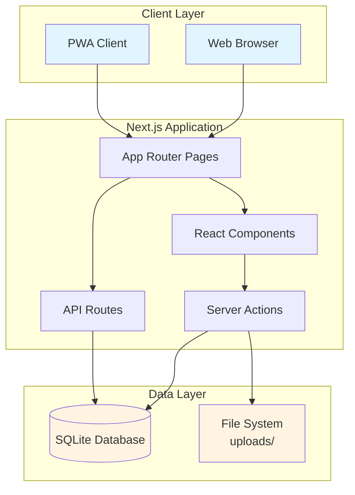

## 🎯 Enhanced Architecture (Target State)

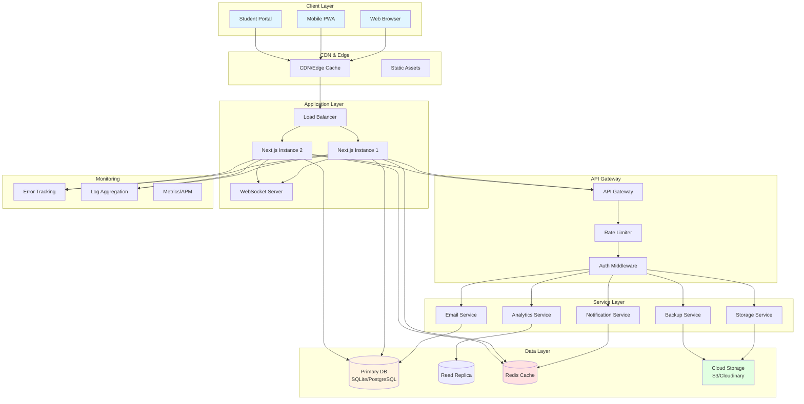

## 📊 Database Schema (Enhanced)

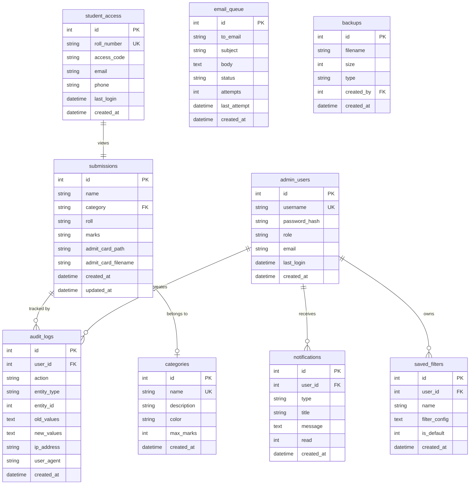

## 🔄 Data Flow Diagrams

### Submission Creation Flow

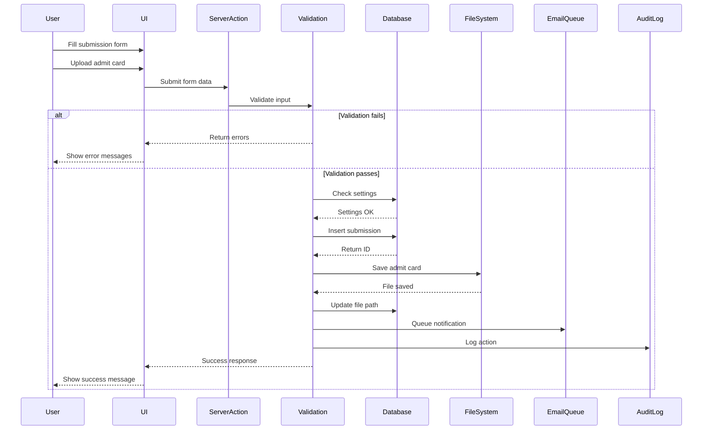

### Authentication Flow

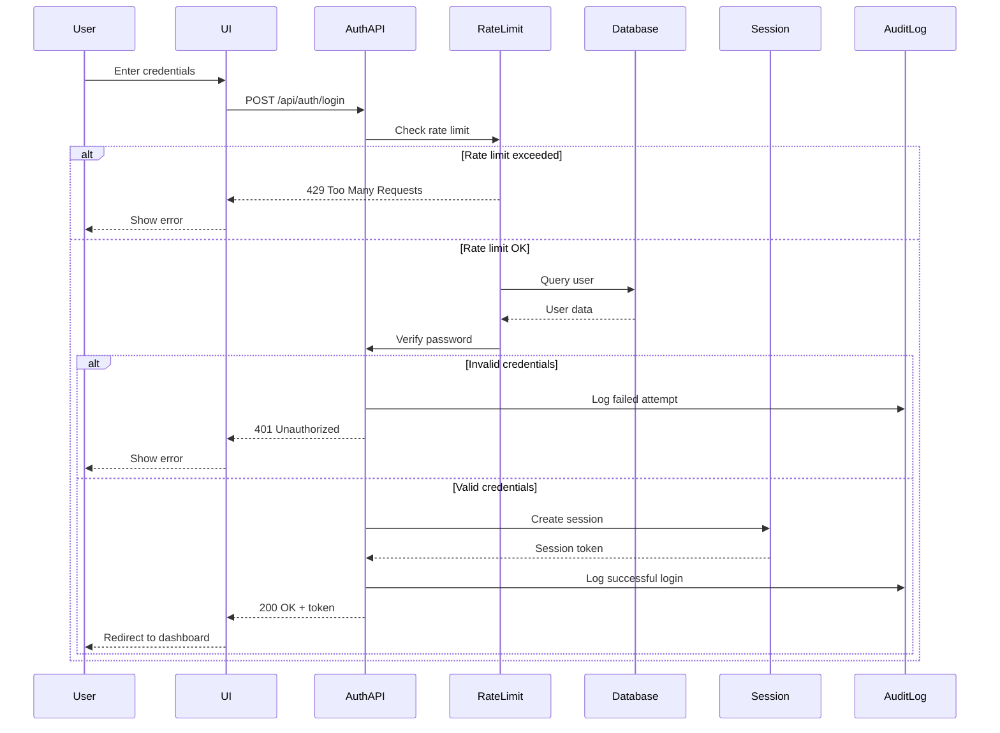

## 🔐 Security Architecture

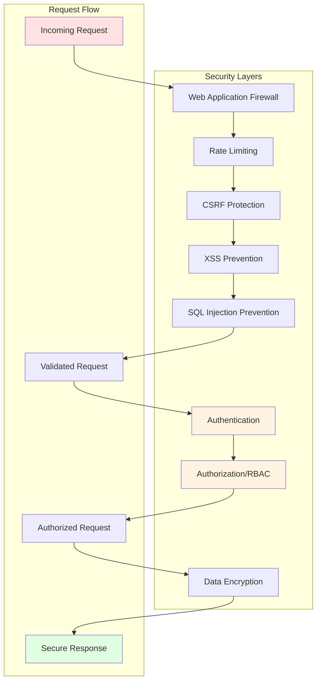

## 📦 Component Architecture

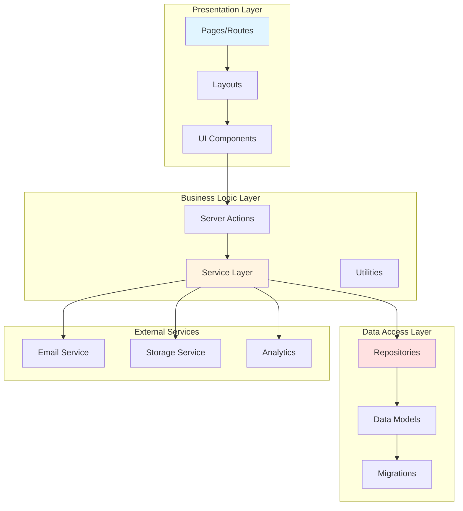

## 🚀 Deployment Architecture

### Development Environment

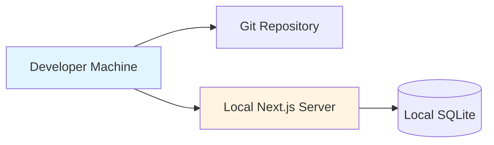

### Production Environment

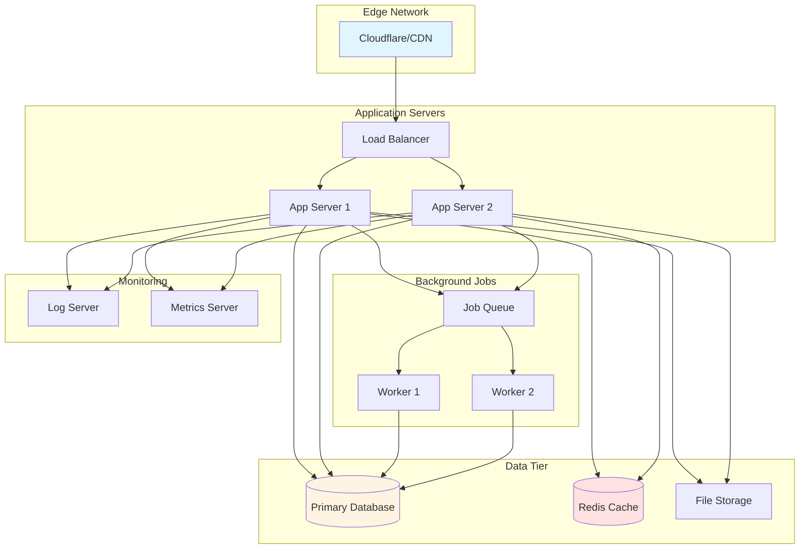

## 🔄 State Management

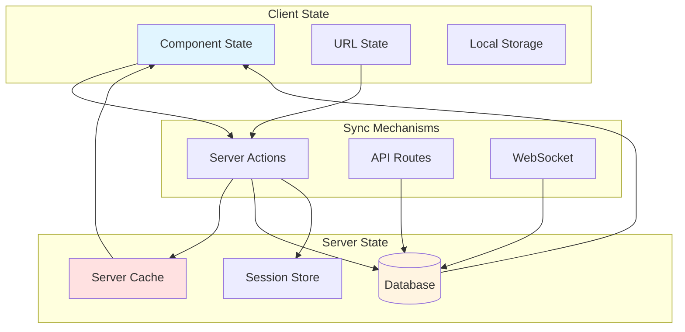

## 📱 Mobile/PWA Architecture

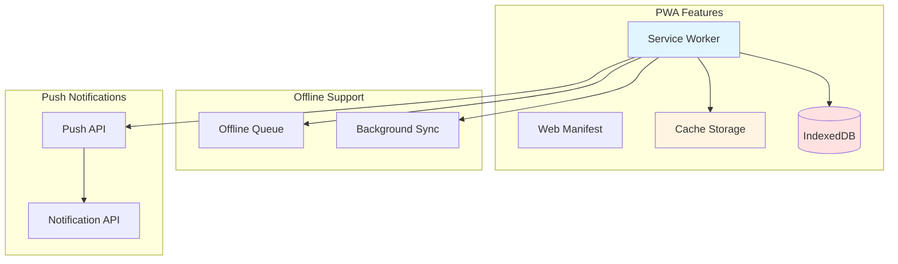

## 🔍 Monitoring & Observability

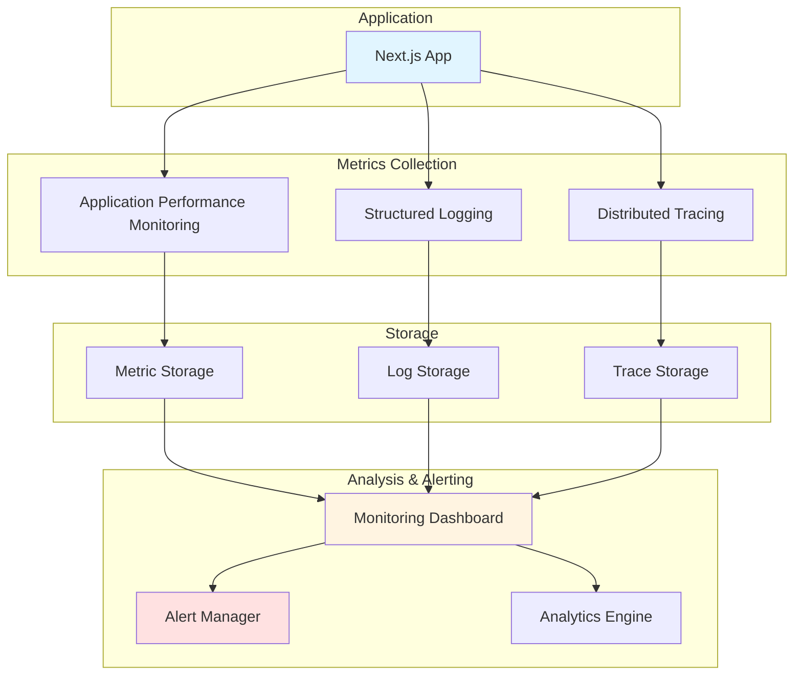

## 🎨 Frontend Architecture

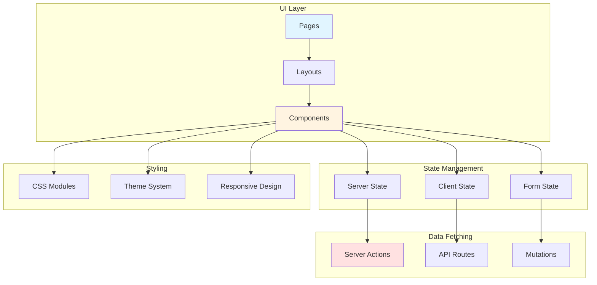

## 🔧 Technology Stack

### Current Stack
- **Framework**: Next.js 16.2.9 (App Router)
- **Runtime**: React 19.2.4
- **Database**: SQLite (better-sqlite3)
- **Styling**: CSS Custom Properties
- **Icons**: Lucide React
- **Notifications**: Sonner

### Enhanced Stack (Proposed)
- **Authentication**: bcryptjs, JWT
- **Validation**: Zod
- **Email**: Nodemailer
- **Caching**: Redis (ioredis)
- **File Processing**: Sharp, PDFKit
- **Charts**: Recharts
- **Real-time**: Socket.io
- **Testing**: Jest, Playwright
- **Monitoring**: Sentry
- **Logging**: Winston
- **i18n**: next-intl

## 📈 Scalability Considerations

### Horizontal Scaling
- Multiple Next.js instances behind load balancer
- Stateless application design
- Session storage in Redis
- Shared file storage (S3/NFS)

### Vertical Scaling
- Database optimization (indexes, query optimization)
- Caching strategy (Redis, CDN)
- Code splitting and lazy loading
- Image optimization

### Database Scaling
- Read replicas for analytics
- Connection pooling
- Query optimization
- Consider PostgreSQL for production

## 🔒 Security Best Practices

1. **Authentication**: Multi-factor authentication, session management
2. **Authorization**: Role-based access control, principle of least privilege
3. **Data Protection**: Encryption at rest and in transit, secure file uploads
4. **Input Validation**: Server-side validation, sanitization, type checking
5. **API Security**: Rate limiting, CORS, API keys, JWT tokens
6. **Monitoring**: Audit logs, security alerts, intrusion detection

## 📚 Additional Resources

- [Next.js Documentation](https://nextjs.org/docs)
- [React Documentation](https://react.dev)
- [SQLite Documentation](https://www.sqlite.org/docs.html)
- [Security Best Practices](https://owasp.org/www-project-top-ten/)